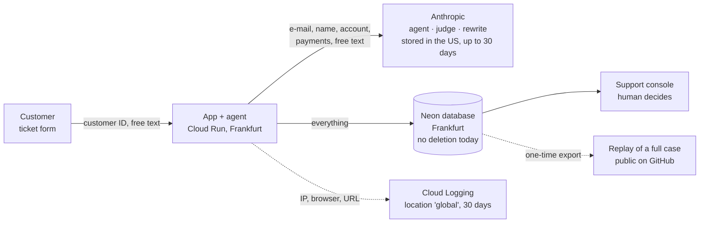

🇩🇪 [Deutsche Version](README_DE.md)

# UC9: AI Act & Data Protection for the Support Agent

> ⚖️ **Not legal advice.** This is a decision memo built from the law and official guidance, as preparation for a conversation with Legal. 11 points where the interpretation is open are marked **"clarify with Legal"** and are not decided here ([list](#open-for-legal)). Cost of this use case: 0 USD, no API calls.

## The Question

**"Real customer tickets from tomorrow: are we allowed to do this, and what do we have to do first?"**

The UC7 support agent runs on Cloud Run. It reads a customer's account and payments, recommends refunds (a human decides), cancels subscriptions on request and drafts replies. So far it has only seen made-up customers.

## Short Answer

- **Limited risk under the AI Act – but a DPIA is required.** Allowed, yes: not high-risk, and the AI Act asks for two things: customers must be told they are dealing with AI, and AI text must be marked.
- **But not tomorrow.** 19 of 28 backlog items have to be done before go-live, and none is fully done today. The biggest are a data protection impact assessment (DPIA), AI notices in the portal, a transfer assessment for Anthropic (USA), deletion periods, and no autonomous refusals of refund requests.
- **Estimated effort for the 19:** 12 small (up to a day), 7 medium (up to a week), plus the time Legal needs for the 11 open points.

## Where the Data Goes

11 stations hold personal data, and 5 of them have no EU location commitment. The full inventory, with file and line for every field and vendor sources, is in [docs/DATENFLUSS.md](docs/DATENFLUSS.md).

## AI Act: Limited Risk

- **Role:** FocusFlow builds the agent and uses it itself, so it is **provider and deployer** (Art. 3(3), 3(11)). The Commission's Art. 50 guidelines name exactly this case. Anthropic provides the underlying model.
- **Not prohibited:** none of the Art. 5 practices applies.
- **Not high-risk:** customer service, refunds and cancellations are not on the Annex III list. The agent does not score creditworthiness, evaluate employees, or use biometrics.
- **It would become high-risk** under any of these changes. High-risk obligations would then apply from 2 Dec 2027.
  - It scores payment behaviour to decide on instalments or "buy on account" (Annex III 5(b)).
  - The console rates support staff individually (4(b)).
  - Voice support adds emotion recognition (1(c)).
- **Applies now:**
  - **Art. 50(1), AI notice, since 2 Aug 2026.** Today the portal even says "A human checks it before it is sent", but for most drafts nobody does.
  - **Art. 50(2), machine-readable marking.** No grace period, because the system went live after 2 Aug 2026.
  - **Art. 4, AI literacy** for support staff.
- **Digital Omnibus** (Regulation (EU) 2026/1744, in force since 27 Jul 2026, checked in EUR-Lex): high-risk dates moved, and Art. 4 lost the "sufficient level". The obligation itself stays.

Details: [docs/AI_ACT.md](docs/AI_ACT.md).

## GDPR: The 5 Points That Matter

1. **A DPIA is required.** The German supervisory authorities' DPIA list names "Kundensupport mittels künstlicher Intelligenz" (AI customer support) as item 11. The inventory already covers the first part of a DPIA.
2. **Transfer to Anthropic (USA).** The basis is the EU standard contractual clauses in Anthropic's DPA, which also requires a transfer impact assessment. Anthropic offers no EU option. Haiku 4.5 cannot even be pinned to the US. Open: whether Anthropic is certified under the EU-US Data Privacy Framework.
3. **Deletion periods.** The code deletes nothing today. Accounting records must be kept 8 years and business letters 6 years (German Commercial Code §257, checked). Tickets and logs need defined periods. We propose 90 days for cases and 7 days for IP logs, both to be confirmed by Legal.
4. **Automated decisions (Art. 22).** The automatic-refund option from UC8 needs Legal first. Two things already happen today without a human: **refusals of refund requests** reach the customer directly, and the agent **cancels subscriptions** itself. Until Legal decides, refusals go to the console and cancellations get a confirmation with a way to reach a human.
5. **Replay.** The demo's start page plays a complete customer case to every visitor and keeps it in a public Git repo. With fake data that is fine. With real data there would be no legal basis. Rule: only synthetic cases.

Details: [docs/DSGVO.md](docs/DSGVO.md).

## Backlog: 28 Items, 19 Before Go-Live

| Group | Items | Before go-live | Examples |
|---|---|---|---|
| Transparency and labelling | 6 | 6 | AI notice in the ticket form, label on autonomous replies, privacy policy |
| Contracts, documentation, literacy | 6 | 6 | DPAs filed, transfer assessment, records of processing, DPIA, staff training |
| Data minimisation | 4 | 1 | customer from login instead of a list; pseudonymisation recommended |
| Logs, storage, deletion | 7 | 4 | EU log bucket, automatic deletion, SDK settings, synthetic replay |
| Data subjects and decisions | 5 | 2 | access and erasure per customer, confirmed cancellations |

Every item has a requirement in product language, the legal basis, today's status in UC7 with file and line, effort and priority: [docs/BACKLOG.md](docs/BACKLOG.md). Two items come with the exact customer-facing text. Pseudonymisation (B13) is worked out as an outlook: design, test approach and a measurement plan (about 5.20 USD, not run).

## Lesson: Configuration Is Not Data Flow

The agent is configured to load no settings and no memory (`setting_sources=[]`). The transcript of a real local run showed otherwise: the bundled Claude Code CLI had put the developer's personal notes and the machine's user path into the support agent's request. It also writes plaintext transcripts and, according to Anthropic, makes an extra model call for session titles.

**What a request contains can only be checked by looking at the request.** That is why the test for B13 captures what actually goes out (local stub via `ANTHROPIC_BASE_URL`, no API cost) and does not inspect the configuration.

## Cost & Latency
- Cost per 1000 requests: does not apply to this use case (0 USD, no API calls). The agent being assessed costs 34.1 USD per 1000 requests (UC7).
- p95 latency: 39.7 s per agent run (UC7, unchanged).
- Quality metric: 28 backlog items, 19 before go-live, 0 fully done today. In the T01 example, 8 of the 64 personal-data hits in the agent's request are direct identifiers. Pseudonymisation would remove all 8.

## What I Would Do Differently
- **Privacy by design from the start, like security by design in UC6.** The data flow belongs at the beginning, before the agent gets tools that read payments. In UC7 the demo was already live when it became clear that the portal promises a human check that does not exist, and that the code deletes nothing.
- **Test the request, not the configuration, from day one.** A stub behind `ANTHROPIC_BASE_URL` costs nothing and would have caught the SDK finding in UC7 already.
- **Put realistic tickets in the gold set.** Signatures, phone numbers and health details are the biggest risk left after pseudonymisation, and the gold set contains none of them.

## Open for Legal

- **AI Act**
  - Is an asynchronous ticket portal an "interaction" under Art. 50(1)?
  - How should short replies be marked under Art. 50(2)?
  - Does the public demo already count as "put into service"?
  - Re-check once the final high-risk guidelines are published.
- **GDPR**
  - Is an LLM "necessary" under Art. 6(1)(b)?
  - What is Anthropic's DPF status, and is the transfer assessment enough?
  - Is support correspondence a business letter that must be kept 6 years?
  - Which concrete deletion periods apply?
  - Is a purely favourable automatic refund covered by Art. 22?
  - Are autonomous refusals and cancellations "decisions" under Art. 22?
  - Does human approval change the DPIA list entry?

Details (German): [Data flow](docs/DATENFLUSS.md) · [Data minimisation](docs/DATENMINIMIERUNG.md) · [AI Act](docs/AI_ACT.md) · [GDPR](docs/DSGVO.md) · [Backlog](docs/BACKLOG.md) · [T01 requests](evals/t01_anfragen.md) · [Decisions](docs/decisions.md)
