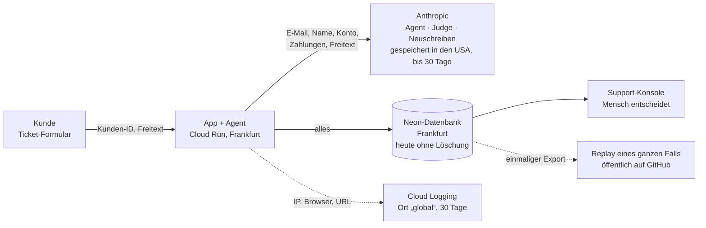

🇬🇧 [English version](README.md)

# UC9: AI Act & Datenschutz für den Support-Agent

> ⚖️ **Keine Rechtsberatung.** Das ist eine Entscheidungsvorlage aus Gesetzestext und offiziellen Leitlinien, als Vorbereitung für das Gespräch mit Legal. 11 Punkte mit unklarer Auslegung sind als **„mit Legal klären“** markiert und hier nicht entschieden ([Liste](#offen-für-legal)). Kosten dieses Use Cases: 0 USD, keine API-Aufrufe.

## Die Frage

**„Ab morgen echte Kundentickets: Dürfen wir das, und was müssen wir vorher tun?“**

Der UC7-Support-Agent läuft auf Cloud Run. Er liest Konto und Zahlungen eines Kunden, empfiehlt Erstattungen (ein Mensch entscheidet), kündigt Abos auf Wunsch und entwirft Antworten. Bisher hat er nur erfundene Kunden gesehen.

## Kurze Antwort

- **Begrenztes Risiko nach dem AI Act – aber eine DSFA ist Pflicht.** Dürfen: ja, kein Hochrisiko, und der AI Act verlangt zweierlei: Kunden erfahren, dass sie es mit KI zu tun haben, und KI-Text wird gekennzeichnet.
- **Aber nicht morgen.** 19 von 28 Backlog-Einträgen müssen vor dem Go-live erledigt sein, heute ist keiner vollständig erfüllt. Die größten sind eine Datenschutz-Folgenabschätzung (DSFA), KI-Hinweise im Portal, ein Transfer Impact Assessment für Anthropic (USA), Löschfristen und keine autonomen Ablehnungen von Geldwünschen.
- **Aufwand der 19, grob geschätzt:** 12 klein (bis 1 Tag), 7 mittel (bis 1 Woche), dazu die Zeit, die Legal für die 11 offenen Punkte braucht.

## Wohin die Daten fließen

11 Stationen speichern personenbezogene Daten, 5 davon ohne Zusage eines EU-Standorts. Die ganze Inventur, mit Datei und Zeile für jedes Feld und mit Anbieterquellen, steht in [docs/DATENFLUSS.md](docs/DATENFLUSS.md).

## AI Act: begrenztes Risiko

- **Rolle:** FocusFlow baut den Agent und nutzt ihn selbst, ist also **Anbieter und Betreiber** (Art. 3(3), 3(11)). Die Art.-50-Leitlinien der Kommission nennen genau diesen Fall. Anthropic liefert das zugrunde liegende Modell.
- **Nicht verboten:** Keine der Praktiken aus Art. 5 trifft zu.
- **Nicht hochriskant:** Kundenservice, Erstattungen und Kündigungen stehen nicht auf der Liste in Anhang III. Der Agent bewertet keine Kreditwürdigkeit, keine Mitarbeiter und nutzt keine Biometrie.
- **Hochriskant würde es** bei einer dieser Änderungen. Die Hochrisiko-Pflichten gälten dann ab 2.12.2027.
  - Der Agent bewertet Zahlungsverhalten, um über Ratenzahlung oder „Kauf auf Rechnung“ zu entscheiden (Anhang III 5(b)).
  - Die Konsole bewertet Support-Mitarbeiter einzeln (4(b)).
  - Ein Sprachsupport bekommt Emotionserkennung (1(c)).
- **Gilt jetzt:**
  - **Art. 50(1), KI-Hinweis, seit 2.8.2026.** Heute steht im Portal sogar „A human checks it before it is sent“, obwohl bei den meisten Entwürfen niemand prüft.
  - **Art. 50(2), maschinenlesbare Kennzeichnung.** Keine Übergangsfrist, weil das System nach dem 2.8.2026 online ging.
  - **Art. 4, KI-Kompetenz** der Support-Mitarbeiter.
- **Digital Omnibus** (Verordnung (EU) 2026/1744, in Kraft seit 27.7.2026, in EUR-Lex geprüft): Die Hochrisiko-Fristen sind verschoben, und Art. 4 verlangt kein „ausreichendes Niveau“ mehr. Die Pflicht selbst bleibt.

Details: [docs/AI_ACT.md](docs/AI_ACT.md).

## DSGVO: die 5 wichtigsten Punkte

1. **DSFA ist Pflicht.** Die DSFA-Muss-Liste der deutschen Aufsichtsbehörden (DSK) nennt unter Nr. 11 „Kundensupport mittels künstlicher Intelligenz“. Den ersten Teil einer DSFA deckt die Inventur schon ab.
2. **Drittlandtransfer zu Anthropic (USA).** Grundlage sind die EU-Standardvertragsklauseln im DPA von Anthropic, dazu ist ein Transfer Impact Assessment nötig. Anthropic bietet keine EU-Option. Haiku 4.5 lässt sich nicht einmal auf die USA festlegen. Offen: ob Anthropic nach dem EU-US Data Privacy Framework zertifiziert ist.
3. **Löschfristen.** Der Code löscht heute nichts. Buchungsbelege müssen 8 Jahre, Handelsbriefe 6 Jahre aufbewahrt werden (HGB §257, geprüft). Tickets und Logs brauchen festgelegte Fristen. Vorschlag: 90 Tage für Fälle und 7 Tage für IP-Logs, beides mit Legal zu bestätigen.
4. **Automatisierte Entscheidungen (Art. 22).** Die Auto-Erstattung aus UC8 braucht vorher Legal. Zwei Dinge passieren heute schon ohne Menschen: **Ablehnungen von Geldwünschen** erreichen den Kunden direkt, und der Agent **kündigt Abos** selbst. Bis Legal entschieden hat, gehen Ablehnungen über die Konsole, und Kündigungen bekommen eine Bestätigung mit Weg zu einem Menschen.
5. **Replay.** Die Startseite der Demo spielt jedem Besucher einen kompletten Kundenfall vor und hält ihn im öffentlichen Git-Repo. Mit erfundenen Daten ist das in Ordnung. Mit echten Daten gäbe es keine Rechtsgrundlage. Regel: nur synthetische Fälle.

Details: [docs/DSGVO.md](docs/DSGVO.md).

## Backlog: 28 Einträge, 19 vor dem Go-live

| Gruppe | Einträge | vor Go-live | Beispiele |
|---|---|---|---|
| Transparenz und Kennzeichnung | 6 | 6 | KI-Hinweis im Formular, Kennzeichnung autonomer Antworten, Datenschutzerklärung |
| Verträge, Dokumentation, Kompetenz | 6 | 6 | AVVs abgelegt, Transfer Impact Assessment, Verarbeitungsverzeichnis, DSFA, Schulung |
| Datenminimierung | 4 | 1 | Kunde aus dem Login statt Liste; Pseudonymisierung empfohlen |
| Logs, Speicher, Löschen | 7 | 4 | EU-Log-Bucket, automatische Löschung, SDK-Einstellungen, synthetisches Replay |
| Betroffene und Entscheidungen | 5 | 2 | Auskunft und Löschung je Kunde, bestätigte Kündigungen |

Jeder Eintrag hat eine Anforderung in Produktsprache, die Rechtsgrundlage, den heutigen Stand in UC7 mit Datei und Zeile, Aufwand und Priorität: [docs/BACKLOG.md](docs/BACKLOG.md). Für zwei Einträge steht der genaue Text dabei, den der Kunde sieht. Die Pseudonymisierung (B13) ist als Ausblick ausgearbeitet: Design, Testansatz und Messplan (ca. 5,20 USD, nicht gelaufen).

## Lektion: Konfiguration ist nicht Datenfluss

Laut Konfiguration lädt der Agent keine Einstellungen und kein Memory (`setting_sources=[]`). Das Protokoll eines echten lokalen Laufs zeigte etwas anderes: Die gebündelte Claude-Code-CLI hatte die persönlichen Notizen des Entwicklers und den Benutzerpfad des Rechners in die Anfrage des Support-Agents gelegt. Außerdem schreibt sie Klartext-Transkripte und macht laut Anthropic einen zusätzlichen Modellaufruf für Sitzungstitel.

**Was eine Anfrage enthält, sieht man nur in der Anfrage.** Deshalb fängt der Test für B13 ab, was tatsächlich rausgeht (lokaler Stub über `ANTHROPIC_BASE_URL`, ohne API-Kosten), statt die Konfiguration zu prüfen.

## Kosten & Latenz
- Kosten pro 1000 Requests: entfällt für diesen Use Case (0 USD, keine API-Aufrufe). Der untersuchte Agent kostet 34,1 USD je 1000 Anfragen (UC7).
- p95-Latenz: 39,7 s je Agent-Lauf (UC7, unverändert).
- Qualitätsmetrik: 28 Backlog-Einträge, 19 vor dem Go-live, heute 0 vollständig erfüllt. Im Beispiel T01 sind 8 der 64 personenbezogenen Fundstellen in der Anfrage des Agents direkte Identifikatoren. Pseudonymisierung würde alle 8 entfernen.

## Was ich anders machen würde
- **Privacy by Design von Anfang an, wie Security by Design in UC6.** Der Datenfluss gehört an den Anfang, bevor der Agent Werkzeuge bekommt, die Zahlungen lesen. In UC7 war die Demo schon online, als klar wurde: Das Portal verspricht eine menschliche Prüfung, die es nicht gibt, und der Code löscht nichts.
- **Von Tag eins die Anfrage testen, nicht die Konfiguration.** Ein Stub hinter `ANTHROPIC_BASE_URL` kostet nichts und hätte den SDK-Fund schon in UC7 gezeigt.
- **Realistische Tickets ins Goldset.** Grußzeilen, Telefonnummern und Gesundheitsangaben sind nach der Pseudonymisierung das größte Restrisiko, und im Goldset kommt keins davon vor.

## Offen für Legal

- **AI Act**
  - Ist ein asynchrones Ticketportal eine „Interaktion“ nach Art. 50(1)?
  - Wie werden kurze Antworten nach Art. 50(2) gekennzeichnet?
  - Gilt die öffentliche Demo schon als „in Betrieb genommen“?
  - Neu prüfen, sobald die endgültigen Hochrisiko-Leitlinien erscheinen.
- **DSGVO**
  - Ist ein LLM nach Art. 6(1)(b) „erforderlich“?
  - Wie ist Anthropics DPF-Status, und reicht das Transfer Impact Assessment?
  - Ist Support-Korrespondenz ein Handelsbrief (6 Jahre)?
  - Welche konkreten Löschfristen gelten?
  - Fällt eine rein begünstigende Auto-Erstattung unter Art. 22?
  - Sind autonome Ablehnungen und Kündigungen „Entscheidungen“ nach Art. 22?
  - Ändert die menschliche Freigabe etwas am Eintrag in der DSFA-Liste?

Details: [Datenfluss](docs/DATENFLUSS.md) · [Datenminimierung](docs/DATENMINIMIERUNG.md) · [AI Act](docs/AI_ACT.md) · [DSGVO](docs/DSGVO.md) · [Backlog](docs/BACKLOG.md) · [T01-Anfragen](evals/t01_anfragen.md) · [Entscheidungen](docs/decisions.md)
