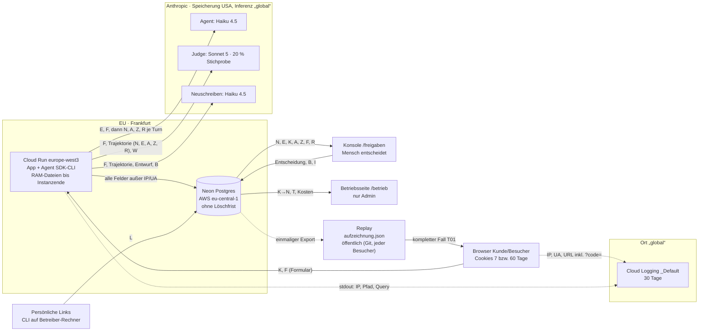

# Datenfluss-Inventur UC7-Agent

Stand 2026-10-08. Quelle: `ai-uc-07-deployment`, Commit `75c5ea3` (live als Revision `uc7-00009-pv4`, Code-Stand `d86b433`). Alle Zeilenangaben beziehen sich auf dieses Repo. Geprüft wurde lesend: der Code, Neon (Read-only-Transaktion als `uc7_app`), Cloud Logging (`gcloud logging read`) und lokale CLI-Protokolle. Keine API-Aufrufe, keine Kosten.

**Annahme dieser Vorlage:** Ab morgen gehen echte Kundentickets durch den Agent. Heute sind die Kundendaten fiktiv (`uc4_agent/data/kunden.json`, 15 Kunden). Echte personenbezogene Daten verarbeitet die Demo heute nur von **Besuchern** (IP-Adresse, Browser, Link-Code, selbst getippter Freitext) und vom **Betreiber**. Jede Aussage unten gilt im Szenario für echte Kundendaten.

## Feldkürzel

| Kürzel | Feld | Herkunft im Code |
|---|---|---|
| N | Name (Vor- und Nachname) | `kunden.json`, über `kunde_nachschlagen` (`uc4_agent/werkzeuge.py:268-270`) |
| E | E-Mail-Adresse | Absender, `app/main.py:447` |
| K | Kunden-ID | Formular, `app/main.py:425` |
| A | Kontodaten: Login-Methode, Plattform, Kunde seit, Abo (Stufe, Anbieter, Status, Periode) | `kunde_nachschlagen` |
| Z | Zahlungen: Zahlungs-ID, Datum, Betrag, Anbieter, Beschreibung | `zahlungen_ansehen` (`uc4_agent/werkzeuge.py:272-275`) |
| F | Freitext des Tickets (bis 1000 Zeichen, beliebiger Inhalt) | Formular, `app/main.py:46`, `:425-435` |
| T | Titel = erste Wörter des Freitexts (bis 60 Zeichen) | `app/hinweise.py:67-79`, `:64` |
| R | Agent-Ergebnisse: Entwurf, Übergabe-Grund, Erstattungsempfehlung (Betrag, Begründung), Kündigung, Agent-Texte | `uc4_agent/werkzeuge.py:300-367`, `app/lauf.py:136` |
| B | Begründung für den Kunden (Konsole, geht in die Antwort) | `app/main.py:653-661` |
| I | Interne Notiz (Konsole, nie an ein Modell) | `app/speicher.py:67`, `:272-276` |
| W | Endgültige Antwort an den Kunden | `app/speicher.py:53-61` |
| J | Judge-Urteil mit Begründung (nennt den Fall) | `app/pruefung.py:182-195` |
| L | Link-Code (Pseudonym + 6 Zufallszeichen) | `app/zugang.py:44-50` |
| IP / UA | IP-Adresse, Browser-Kennung | Cloud Run, Request-Log |

## Diagramm

## Übersicht

| Station | Personenbezogene Felder | Ort | Aufbewahrung | Rolle des Anbieters |
|---|---|---|---|---|
| 1. Browser | K, F (Formular); Seiten zeigen N, E, A, Z, R, W; Cookies mit L | Gerät des Nutzers | Admin-Cookie 7 Tage, Link-Cookie 60 Tage | keiner |
| 2. Cloud Run | alle Felder im Arbeitsspeicher; Dateien je Lauf; CLI-Protokolle | Frankfurt (`europe-west3`) | bis Ende der Instanz | Google: Auftragsverarbeiter |
| 3. Neon | N (über K), E, K, A, Z, F, T, R, B, I, W, J, L | AWS `eu-central-1` (Frankfurt) | **keine Löschung im Code** | Neon (Databricks): DPA vorhanden, Rolle auf neon.com nicht ausdrücklich |
| 4. Anthropic Agent | E, F, N, A, Z, R (ganzer Verlauf je Turn) | gespeichert USA, Inferenz weltweit | bis 30 Tage, bei Markierung bis 2 Jahre | Anthropic: Auftragsverarbeiter |
| 5. Anthropic Judge | F, N, E, A, Z, R, W bzw. Entwurf, Entscheidung, B | wie 4 | wie 4 | wie 4 |
| 6. Haiku-Neuschreiben | F, N, E, A, Z, R, Entwurf, B | wie 4 | wie 4 | wie 4 |
| 7. Cloud Logging | IP, UA, URL (Run-ID, Link-Code), Fehlertexte | Bucket-Ort **„global“** | 30 Tage (`_Default`) | Google: Auftragsverarbeiter |
| 8. Konsole | N, E, K, A, F, R (Entwurf, Begründung), B, I | Browser des Bearbeiters, Daten aus 3 | wie 3 | keiner (eigene Mitarbeiter) |
| 9. Replay | kompletter Fall T01: N, E, K, A, Z, F, R, W, J | Git-Repo (öffentlich), Container-Image, jeder Besucher | unbegrenzt (Git-Historie) | GitHub, Google (Build) |
| 10. Persönliche Links | L; über `laeufe.zugang` verknüpft mit F des Besuchers | Neon, URL, Logs, Browser | Link 60 Tage gültig, Zeile bleibt | wie 3 und 7 |
| 11. Betriebsseite | K→N, T, Kosten, Dauer, Status, Judge-Ergebnis | Browser Admin, Daten aus 3 | wie 3 | keiner |

## Die Stationen im Einzelnen

### 1. Browser

- **Rein:** Kunden-ID und Freitext per Formular (`app/templates/anliegen.html:22-37`, `app/main.py:425`). Der Absender wird nie aus dem Formular genommen, sondern aus dem gewählten Kunden (`app/main.py:447`).
- **Raus:** Die Laufseite zeigt Schritte live per SSE, darin jedes Werkzeug-Ergebnis mit Name, E-Mail, Kontodaten und Zahlungen (`app/main.py:456-460`, `:563-580`), dazu Entwurf oder Antwort (`app/main.py:209-226`).
- **Auffällig:** Das Formular listet allen Nutzern mit Zugang alle 15 Kunden mit Name, E-Mail und Abo (`app/templates/anliegen.html:26`). Für die Demo gewollt, mit echten Kunden unzulässig. Ein echtes Portal kennt den Kunden aus dem Login.
- **Cookies:** `uc7_zugang` (Admin, HMAC über den Code, 7 Tage, `app/zugang.py:19-20`), `uc7_link` (Link-Code im Klartext + Signatur, 60 Tage, `app/zugang.py:21-22`, `:53-54`). Beide `httponly`, `samesite=lax` (`app/main.py:267-269`, `:339-340`).
- **Keine externen Ressourcen:** htmx und CSS kommen vom eigenen Server (`app/templates/base.html:8-10`). Kein Tracking, keine Fremd-Schriften.

### 2. Cloud Run (App und Agent-Prozess)

- **Region:** `europe-west3` Frankfurt (`docs/deploy.md:3`, `:80`).
- **Im Arbeitsspeicher:** Ereignisse jedes laufenden Laufs in `BEOBACHTER` (`app/lauf.py:70-71`), bis die Instanz endet.
- **Dateien je Lauf** unter `DATEN_DIR/laeufe/<run_id>/` = `/daten/laeufe/…` (`Dockerfile:21-23`, `app/einstellungen.py:30-32`, `app/lauf.py:125`): `trajektorie.jsonl` mit jedem Werkzeugaufruf samt Ergebnis (`uc4_agent/werkzeuge.py:167-170`), dazu `antwortentwuerfe.jsonl`, `erstattungsempfehlungen.jsonl`, `uebergaben.jsonl`, `kuendigungen.jsonl` (`uc4_agent/werkzeuge.py:308`, `:327`, `:353`, `:366`). Cloud Run hat kein dauerhaftes Dateisystem. Die Dateien liegen im Arbeitsspeicher der Instanz und verschwinden mit ihr. Gelöscht werden sie vorher nie.
- **CLI-Protokolle (nicht im UC7-Code, kommt vom Agent SDK):** Die gebündelte Claude-Code-CLI schreibt jede Sitzung im Klartext nach `$HOME/.claude/projects/<cwd>/<session>.jsonl` (`Dockerfile:10-11`). Das Protokoll enthält die komplette Unterhaltung: Ticket, jedes Werkzeug-Ergebnis, Entwurf. Lokal belegt: `~/.claude/projects/-Users-juliansautner-dev-ai-uc-07-deployment-daten-laeufe-20260928-141202-d965b1/7932eab2-….jsonl` (T01, 2026-09-28). Laut Anthropic gilt: 30 Tage Standard, nicht verschlüsselt, abschaltbar mit `CLAUDE_CODE_SKIP_PROMPT_HISTORY`. Das Python-SDK hat keine eigene Option dafür (Quelle s. Anbieter). Im Container endet es mit der Instanz.
- **Build:** `gcloud run deploy --source .` lädt den Code in den Bucket `run-sources-focusflow-demo-510014-europe-west3` und das Image nach Artifact Registry (`docs/deploy.md:63`, `:89`). Darin steckt `app/replay/aufzeichnung.json` (Station 9) und `uc4_agent/data/` mit allen Kundendaten. Mit echten Kunden kämen diese aus einer Datenbank, nicht aus dem Image.
- **Secrets:** API-Key, Zugangscode, Session-Secret und Datenbank-URL liegen im Secret Manager mit `--replication-policy=automatic` (`docs/deploy.md:33`). Keine personenbezogenen Daten, aber der Ort der Replikation ist nicht auf die EU festgelegt.

### 3. Neon (Protokoll)

- **Region:** AWS `eu-central-1` (Frankfurt). Belegt über den Hostnamen in `DATABASE_URL` (`…c-6.eu-central-1.aws.neon.tech`), Entscheidung in `docs/decisions.md:29`.
- **Tabellen** (`app/speicher.py:17-76`):
  - `laeufe`: `kunden_id`, `absender` (E), `text` (F), `titel` (T), `ergebnis` (JSON: Entwurf, Empfehlungen, Übergaben, Kündigungen, Schlusstext), `ereignisse` (JSON: jeder Werkzeugaufruf mit vollem Ergebnis, also N, E, A, Z), `zugang` (L).
  - `empfehlungen`: `kunden_id`, `zahlungs_id`, `betrag_usd`, `begruendung`.
  - `freigaben`: `entscheidung`, `kommentar` (B), `notiz` (I).
  - `antworten`: `text` (W), `entscheidungen` (JSON inkl. B).
  - `pruefungen`: `regeln`, `judge` (J, Begründungen nennen Beträge und Hergang).
  - `zugangslinks`: `code` (L), `erstellt`, `laeufe`, `gesperrt`.
- **Aufbewahrung:** Der Code löscht nie. Die App-Rolle `uc7_app` darf nur in `pruefungen` löschen (`docs/deploy.md:47-48`). Läufe bleiben also unbegrenzt. Dazu kommt die Wiederherstellungs-Historie von Neon (s. Anbieter).
- **Bestand heute** (lesend geprüft 2026-10-08): 13 Läufe seit 2026-09-28, 6 verschiedene Kunden-IDs, 0 Zeilen in `zugangslinks`. Die 4 URLs mit `code=` im Log (Station 7) gehören also zu Codes, die es in der Tabelle nicht (mehr) gibt, etwa Tests mit unbekanntem Code. Geprüft ist das nicht.

### 4. Anthropic: Agent (Haiku 4.5 über Agent SDK)

- **Aufruf:** `app/lauf.py:130-132`. Konfiguration `uc4_agent/agent.py:185-210`: Modell `claude-haiku-4-5`, eigener System-Prompt v3, nur die 7 eigenen Werkzeuge, `setting_sources=[]`.
- **Erste Nachricht:** `"Neues Ticket\nVon: <E>\n\n<F>"` (`uc4_agent/agent.py:181-182`).
- **Jeder weitere Turn** schickt den ganzen bisherigen Verlauf: jeden Werkzeugaufruf und jedes Ergebnis als JSON-Text (`uc4_agent/mcp_server.py:82-87`). Nach `kunde_nachschlagen` sind N, E und A drin, nach `zahlungen_ansehen` alle Zahlungen des Kunden (Z), auch Zahlungen, die nichts mit dem Anliegen zu tun haben. T01: 6 Turns.
- **Was die CLI selbst ergänzt** (nicht im UC7-Code, belegt im lokalen Protokoll oben, Einträge 3-12): Arbeitsverzeichnis, Plattform, Betriebssystem, Modell, Datum, Budget als `system-reminder`. Lokal hat die CLI außerdem das **Auto-Memory des Entwicklers** (`~/.claude/projects/…/memory/MEMORY.md`) in den Kontext des Support-Agents geladen, obwohl `setting_sources=[]` gesetzt ist. Und der Pfad mit dem Benutzernamen des Rechners war enthalten. Im Container gibt es kein solches Memory. Belegt ist das nur lokal, für Cloud Run ist es **offen** (kein Protokoll aus dem Container).
- **Sitzungstitel:** Das lokale Protokoll enthält `ai-title: "Doppelte Abbuchung Jahresabo"`. Laut Anthropic-Doku erzeugt Claude Code den Titel mit einem **zusätzlichen Hintergrund-Aufruf** an ein kleines Modell aus der ersten Nachricht. Ob das für Agent-SDK-Läufe in Produktion auch gilt: **offen**. Der lokale Befund spricht dafür.
- **Telemetrie der CLI:** Laut Doku sind Nutzungsmetriken bei API-Key standardmäßig an, ohne Prompts oder Inhalte. Der Deploy setzt weder `DISABLE_TELEMETRY` noch `CLAUDE_CODE_DISABLE_NONESSENTIAL_TRAFFIC` (`docs/deploy.md:85`).
- Ort, Aufbewahrung, Rolle: s. Anbieter-Unterlagen.

### 5. Anthropic: Judge (Sonnet 5)

- **Wann:** nach jedem Lauf für 20 % der Läufe, ausgewählt per Hash der Run-ID (`app/pruefung.py:26`, `:135-137`, `app/main.py:154`), auf die endgültige Antwort nach einer Entscheidung (`app/main.py:183-184`) und von Hand auf der Betriebsseite (`app/main.py:677-685`). Deckel 0,50 USD im Monat (`app/pruefung.py:27`).
- **Inhalt** (`app/pruefung.py:170-174`): Referenzdatum, Ticket (F), die ganze Trajektorie mit allen Werkzeug-Ergebnissen außer den Entwürfen (`app/pruefung.py:140-148`), die Entscheidung mit Begründung für den Kunden (B, `app/pruefung.py:151-167`), der bewertete Text (Entwurf oder W). **Ohne** interne Notiz (`app/speicher.py:272-276`).
- Rückgabe J wird in `pruefungen.judge` gespeichert.

### 6. Anthropic: Haiku schreibt neu

- **Endgültige Antwort nach Freigabe** (`app/main.py:168-184`, `app/antwort.py:63-73`): Ticket, Trajektorie, Agent-Entwurf, Entscheidung mit Begründung für den Kunden.
- **Antwort ohne Zusage** (`app/main.py:186-207`, `app/antwort.py:110-123`): Ticket, Trajektorie, Entwurf, beanstandete Sätze, Begründung.
- Beide Male **ohne** interne Notiz. Fällt der Aufruf aus oder ist das Budget erschöpft, greift eine Vorlage ohne Modell. Die braucht nur den Vornamen (`app/antwort.py:28-29`, `:51-60`).

### 7. Cloud Logging

- **Request-Log** (`run.googleapis.com/requests`, von Cloud Run, nicht vom Code): `remoteIp`, `userAgent`, `requestUrl` mit Query-String, `status`, `latency` u. a. Felder lesend geprüft 2026-10-08.
- **stdout** (`run.googleapis.com/stdout`): Uvicorn-Zugriffslog mit Client-IP (wegen `--proxy-headers` die echte, `Dockerfile:30`), Methode, Pfad und Query, dazu App-Logs (`app/main.py:81`). Die App loggt nur Run-IDs und Fehler-Tracebacks (`app/lauf.py:144`, `app/main.py:164`, `:181`, `:202`), keine Ticketinhalte.
- **Belegt am Bestand:** Die Run-ID des T01-Laufs steht in 53 Request- und 53 stdout-Einträgen. URLs mit `code=` stehen in 4 Request- und 4 stdout-Einträgen (Werte nicht ausgegeben). Damit liegt ein **Link-Code zusammen mit der IP-Adresse** im Log.
- **Ort und Aufbewahrung:** Bucket `_Default`, Ort **`global`**, 30 Tage. `_Required` (nur Audit-Logs) 400 Tage, gesperrt (`gcloud logging buckets list`, 2026-10-08). Weitere Logs: `cloudaudit…/data_access`, `cloudbuild`, `clouderrorreporting…/insights`.

### 8. Support-Konsole (`/freigaben`)

- **Zeigt** je offener Empfehlung: Kunde (N, K, Abo), Absender (N, K, E), das ganze Ticket (F), Regelprüfung, Agent-Entwurf (`app/main.py:594-610`, `app/templates/konsole.html:27-44`). Bei Entwürfen mit Zusage dasselbe mit markierten Sätzen (`app/templates/konsole.html:66-70`). Zuletzt entschiedene Fälle mit Begründung und **interner Notiz** (`app/templates/konsole.html:95-99`). Übergaben mit Name und Grund (`app/templates/konsole.html:112-115`).
- **Schreibt:** Entscheidung, Begründung für den Kunden (B, max. 1000 Zeichen), interne Notiz (I, max. 1000 Zeichen) (`app/main.py:653-664`).
- **Wer sieht was:** Der Admin sieht alles. Ein Besucher mit Link sieht nur Fälle mit seinem Code (`app/main.py:237-245`, `:621`).

### 9. Replay (Aufzeichnung ohne Login)

- `app/replay/aufzeichnung.json` = Lauf `20260928-190527-a9c291` (T01), einmalig aus Neon exportiert (`scripts/replay_export.py:22-39`, ohne interne Notiz). Geladen beim Start (`app/main.py:64`), an **jeden anonymen Besucher** per SSE ausgespielt (`app/main.py:364-394`).
- **Enthält:** Ticket, alle Werkzeug-Ergebnisse (N, E, K, A, alle 5 Zahlungen), Entwurf, Empfehlung, Entscheidung, endgültige Antwort, beide Prüfungen mit Judge-Begründung.
- **Liegt:** im öffentlichen GitHub-Repo (Commit `6b61e25`) und im Container-Image. Mit echten Kundendaten wäre das eine Veröffentlichung. Für eine Demo mit echtem Betrieb bräuchte es einen synthetischen Fall.

### 10. Persönliche Links

- **Anlegen** auf dem Rechner des Betreibers per CLI gegen Neon (`app/links.py:3-9`, `:33-37`). Gespeichert werden Code, Zeitpunkt, Anzahl Läufe, Sperrvermerk (`app/speicher.py:70-75`). Das Pseudonym soll kein Personenname sein (`app/links.py:8-9`), erzwungen wird das nicht (`app/zugang.py:44-50`).
- **Personenbezug trotzdem:** Der Betreiber weiß, wem er welchen Link geschickt hat. `laeufe.zugang` verknüpft den Code mit jedem Freitext, den der Besucher tippt (`app/main.py:442-451`). Der Code steht in der URL. Er landet im Request-Log mit IP-Adresse (Station 7) und im Cookie (60 Tage). Die Weiterleitung entfernt ihn nur aus der Adresszeile (`app/main.py:289-292`).
- **Ablauf:** 5 Läufe, 60 Tage gültig (`app/speicher.py:82-83`). Danach bleibt die Zeile bestehen, gelöscht wird nichts.

### 11. Betriebsseite (`/betrieb`, nur Admin)

- **Zeigt:** die letzten 20 Läufe mit Titel (T = erste Wörter des Freitexts), Kundenname über die Kunden-ID, Status, Kosten, Dauer und Prüfungen (`app/main.py:669-674`, `app/speicher.py:356-359`, `app/templates/betrieb.html:73`). Kennzahlen ohne Personenbezug (`app/main.py:699-737`).
- **Zugriff:** Nur der Admin, Besucher mit Link werden umgeleitet (`app/main.py:52`, `:294-295`).

## T01 (Anna Berger) durch alle Stationen

Lauf `20260928-190527-a9c291` auf Cloud Run, 2026-09-28. Die drei Anfragen an Anthropic stehen wörtlich mit Markierung in [evals/t01_anfragen.md](../evals/t01_anfragen.md).

| # | Station | Was von Anna dort liegt | Beleg |
|---|---|---|---|
| 1 | Browser | Formular: `K001`, Ticket (219 Zeichen). Zurück: 6 Schritte live, darin Name, E-Mail, Abo, 5 Zahlungen | `aufzeichnung.json` |
| 2 | Cloud Run | `/daten/laeufe/20260928-190527-a9c291/` mit Trajektorie, Empfehlung, Entwurf; CLI-Protokoll der Sitzung, bis Instanzende | Code, s. Station 2 |
| 4 | Anthropic Agent | 6 Turns, im letzten 10.228 Zeichen Inhalt mit 64 markierten Fundstellen: E-Mail 3×, Kunden-ID 12×, Zahlungs-IDs 15×, Beträge 12×, Daten 15×, Name/Vorname 5× | evals/t01_anfragen.md, Teil 1 |
| 3 | Neon | 1 Zeile `laeufe` (alle Spalten außer `zugang` gefüllt), 1 `empfehlungen`, 1 `freigaben` (bestätigt, Begründung und Notiz leer), 1 `antworten`, 2 `pruefungen` | Read-only-Abfrage 2026-10-08 |
| 8 | Konsole | Karte mit Name, K001, E-Mail, Ticket, Regelprüfung, Entwurf; entschieden am 2026-09-28 19:09 UTC | `aufzeichnung.json` |
| 6 | Haiku | 8.447 Zeichen: Ticket, Trajektorie, Entwurf, Entscheidung; 50 Fundstellen | evals/t01_anfragen.md, Teil 3 |
| 5 | Judge | 8.521 Zeichen (5.839 Input-Tokens): Ticket, Trajektorie, Entscheidung, Antwort; 53 Fundstellen | evals/t01_anfragen.md, Teil 2 |
| 7 | Cloud Logging | Run-ID in 53 Request- und 53 stdout-Einträgen mit IP-Adressen (der Aufrufer, nicht von Anna) | `gcloud logging read`, 2026-10-08 |
| 11 | Betrieb | Titel „Doppelt abgebucht beim Jahresabo“, Anna Berger, 0,0256 USD, 25,4 s | Neon, `aufzeichnung.json` |
| 9 | Replay | der ganze Fall, öffentlich auf GitHub und für jeden Besucher | `app/replay/aufzeichnung.json` |
| 10 | Links | keiner (Admin-Lauf, `zugang` leer) | Neon |

Was der Agent über Anna erfährt, aber für den Fall nicht braucht: die drei Monatszahlungen Z001–Z003 (Juli bis September), Login-Methode, Kunde seit. Mehr dazu in [DATENMINIMIERUNG.md](DATENMINIMIERUNG.md).

## Anbieter-Unterlagen (nur Primärquellen)

Abgerufen am 2026-10-08. Zitate wörtlich, über WebFetch. Vor der Übernahme in einen Vertrag am Original gegenlesen.

### Anthropic

| Frage | Antwort | Quelle |
|---|---|---|
| DPA? | Ja. Er ist per Verweis Teil der Commercial Terms, eine eigene Unterschrift ist nicht nötig: „Data submitted through the Services will be processed in accordance with the Anthropic Data Processing Addendum ("DPA"), which is incorporated into these Terms by reference." | https://www.anthropic.com/legal/commercial-terms (gültig ab 17.06.2025), DPA: https://www.anthropic.com/legal/data-processing-addendum (gültig ab 24.02.2025) |
| Rolle | Auftragsverarbeiter: „With respect to Customer Personal Data, Customer is the controller and Anthropic is Customer's processor" (DPA B.1) | DPA |
| Wo verarbeitet? | „By default, we may route customer traffic to select countries in the US, Europe, Asia and Australia" und „Note that data is stored in the US." | https://privacy.claude.com/en/articles/7996890 (15.06.2026) |
| EU-Option? | **Nein.** Inferenz nur `"global"` (Standard) oder `"us"`, Speicherort („Workspace geo“) nur `"us"`. `inference_geo` gibt es erst ab Claude 4.6. **Haiku 4.5 (Agent, Neuschreiben) lehnt den Parameter ab**, läuft also immer „global“. | https://platform.claude.com/docs/en/manage-claude/data-residency |
| Drittlandtransfer | SCC Modul 2 und 3: „the terms of the SCCs Module Two (controller to processor) and/or Module Three (processor to processor)…are hereby incorporated by reference" (DPA I.1). EU-US Data Privacy Framework: **offen**, in keiner geprüften Primärquelle genannt. | DPA |
| Aufbewahrung API | „For Anthropic API users, we automatically delete inputs and outputs on our backend within 30 days of receipt or generation". Ausnahmen: Vereinbarung (ZDR), Durchsetzung der Usage Policy, Gesetz. Bei Markierung bis 2 Jahre: „if a chat or session is flagged, Anthropic may retain inputs and outputs for up to 2 years." | https://privacy.claude.com/en/articles/7996866 (01.07.2026); https://platform.claude.com/docs/en/manage-claude/api-and-data-retention |
| Widerspruch | Die API-Doku schreibt auch: „Conversation content (your prompts and Claude's outputs) is not retained by default; the exception is Covered Models, which require 30-day retention" (Covered = Fable 5/5.1, Mythos 5/5.1). Im Kontext der Seite bezieht sich das auf Funktionen unter ZDR. Für die Planung gilt die Privacy-Center-Aussage: **bis 30 Tage**. Klärung beim Anbieter offen. | ebd. |
| ZDR | Nur über den Vertrieb, je Organisation. Ob ein Pay-as-you-go-Konto ZDR bekommt: **offen**. | ebd. |
| Training | „Anthropic may not train models on Customer Content from Services." | Commercial Terms |
| Unterauftragsverarbeiter | Liste unter https://trust.anthropic.com/subprocessors. Inhalt **offen**: Die Seite wird per JavaScript geladen und ließ sich nicht automatisch lesen. Manuell prüfen. | DPA |
| Claude Code / Agent SDK | Lokale Transkripte: „store session transcripts locally in plaintext under `~/.claude/projects/` for 30 days by default". Abschalten mit `CLAUDE_CODE_SKIP_PROMPT_HISTORY`, „the Python SDK has no equivalent option" (zu `persistSession`). Telemetrie: Metriken ohne Prompts, `DISABLE_TELEMETRY=1`. Sitzungstitel: „written by a background request to the small/fast model". | https://code.claude.com/docs/en/data-usage, https://code.claude.com/docs/en/claude-directory, https://code.claude.com/docs/en/sessions |

### Google Cloud

| Frage | Antwort | Quelle |
|---|---|---|
| DPA? | Ja, Cloud Data Processing Addendum (CDPA): „This Cloud Data Processing Addendum … is incorporated into the Agreement(s) … between Google and Customer." Ein ausdrücklicher Satz „gilt ohne gesonderte Annahme“ fehlt, der CDPA gilt ab dem Tag, an dem er akzeptiert wurde. | https://cloud.google.com/terms/data-processing-addendum (08.06.2026) |
| Rolle | „Google is a processor and Customer is a controller or processor, as applicable, of Customer Personal Data." | CDPA |
| Wo verarbeitet? | Für gelistete Dienste (darunter Cloud Run, Cloud Logging, Cloud Build, Artifact Registry, Secret Manager) „Google will store Customer Data for that Service at rest only within the selected Region“. Die Zusage gilt **nur für die gewählte Region**. Ausgenommen sind Ressourcen-IDs und Labels. | https://cloud.google.com/terms/service-terms (08.10.2026), https://cloud.google.com/terms/data-residency (08.09.2026) |
| Logging | „_Required and _Default, which are in the global location. You can't change the location of existing buckets." Den Ort zeigt Google nur an („GLOBAL (US-WEST4)“), zugesagt wird er nicht. `_Default` lässt sich auf einen neuen Bucket in `europe-west3` umleiten, `_Required` nicht (nur Audit-Logs). | https://docs.cloud.google.com/logging/docs/regionalized-logs (06.10.2026) |
| Request-Log-Felder | `requestUrl` enthält „the query portion of the URL“, `remoteIp`: „The IP address (IPv4 or IPv6) of the client“, dazu `userAgent`. Am echten UC7-Log bestätigt (Station 7). | https://docs.cloud.google.com/logging/docs/reference/v2/rest/v2/LogEntry (04.09.2026) |
| Secret Manager | Bei automatischer Replikation gilt: „replicates the secret across multiple regions globally“. Damit gibt es keine EU-Zusage. | https://docs.cloud.google.com/secret-manager/docs/choosing-replication (07.10.2026) |
| Drittlandtransfer | SCCs (Controller-to-Processor bzw. Processor-to-Processor), sofern keine „Alternative Transfer Solution“ gilt (CDPA §4.1). Google LLC ist DPF-zertifiziert. Ob das DPF ausdrücklich als Grundlage für Cloud-Kundendaten erklärt ist: **offen**. | CDPA; https://cloud.google.com/terms/sccs/eu-c2p; https://policies.google.com/privacy/frameworks (23.08.2025) |
| Aufbewahrung | Logging: `_Default` 30 Tage (einstellbar 1–3650 Tage), `_Required` 400 Tage, nicht einstellbar. Löschung nach Vertragsende: Wiederherstellung bis 30 Tage, danach höchstens 180 Tage (CDPA). Build-Logs im Google-eigenen Bucket: Ort und Dauer **offen**. Source-Upload-Bucket: Dauer **offen**. | https://docs.cloud.google.com/logging/quotas (06.10.2026); https://docs.cloud.google.com/build/docs/securing-builds/build-log-storage |
| Unterauftragsverarbeiter | https://cloud.google.com/terms/subprocessors (20.08.2026) | CDPA |

### Neon

Neon gehört zu Databricks („Databricks, Inc., the parent company of Neon, LLC“). `neon.com/dpa` und `neon.com/subprocessors` leiten auf Neon- bzw. Databricks-Seiten weiter. Gezählt werden diese als Primärquelle des Anbieters.

| Frage | Antwort | Quelle |
|---|---|---|
| DPA? | Ja. Das Product Specific Schedule gilt für jeden Nutzer: „By accessing the Platform Services, Customer agrees to the terms of this Schedule … subject to the … Databricks Master Cloud Services Agreement". Es ändert den DPA ab (§7 Audits). Im MCSA steht: „The terms of the DPA are incorporated by reference“. Ausdrücklich „gilt auch im Free-Plan“ steht nirgends. Nach dem Wortlaut gilt es für alle Nutzer, auch im Free-Plan. | https://neon.com/platform-terms (05.08.2026); https://www.databricks.com/legal/mcsa; DPA-PDF https://www.databricks.com/sites/default/files/legal/dpa-20230721.pdf (nicht ausgewertet) |
| Rolle | Ausdrückliche Zuweisung „Auftragsverarbeiter“ auf neon.com: **offen**. Steht vermutlich im Databricks-DPA. | – |
| Wo verarbeitet? | „Each Neon project exists in exactly one region. Your database runs in that region.“ Darunter AWS Europe (Frankfurt) `aws-eu-central-1`. Eine Zusage, dass auch WAL und Backups nur dort liegen: **offen**. | https://neon.com/docs/introduction/regions |
| Unterauftragsverarbeiter | AWS (USA, Ort „Customer Selected“) und weitere laut Databricks-Liste. Zusätzlich: „Grafana Labs located in the United States for infrastructure services". | https://neon.com/platform-terms; https://www.databricks.com/legal/databricks-subprocessors (09.06.2026) |
| Drittlandtransfer | Auf neon.com steht nur: „We offer Data Processing Agreements (DPA) and support compliant cross-border data transfers.“ SCC-Modul oder DPF: **offen** (im Databricks-DPA-PDF nachlesen). | https://neon.com/security |
| Aufbewahrung | Code: keine Löschung. Neon: Wiederherstellungsfenster im Free-Plan „6-hour limit, capped at 1 GB of change history“. Backups: „retained for 30 days“. Gelöschtes Projekt: „You can recover the project within seven days.“ Ob die 30-Tage-Backups danach weiterlaufen: **offen**. | https://neon.com/docs/introduction/plans; https://neon.com/docs/security/security-overview; https://neon.com/docs/manage/projects |
| Zugriff durch Neon | Zugriff auf Kundendaten „via controlled interfaces … through "just in time" (JITA) requests for access; all such requests are logged." | https://neon.com/platform-terms, Exhibit A |

## Offene Punkte

1. **Anthropic, Unterauftragsverarbeiter:** Liste (trust.anthropic.com) im Browser lesen, Anbieter und Länder eintragen.
2. **Anthropic, Aufbewahrung:** Widerspruch „bis 30 Tage“ (Privacy Center) gegen „not retained by default“ (API-Doku) klären. Klären, ob ein Pay-as-you-go-Konto ZDR bekommt.
3. **Anthropic, DPF:** Nicht genannt. Grundlage sind nach den Quellen nur SCC Modul 2/3.
4. **Agent SDK im Container:** Lädt die CLI dort zusätzlichen Kontext? Gibt es den Titel-Aufruf auch dort? Ist die Telemetrie an? Belegt ist bisher nur das lokale Protokoll. Prüfbar ohne API-Kosten nur eingeschränkt, ein echter Lauf kostet ca. 0,03 USD.
5. **Google, Logging:** `_Default` liegt „global“. Ob ein regionaler Bucket gewünscht ist, ist eine Entscheidung, keine Recherche.
6. **Google, Build:** Ort und Dauer der Build-Logs und des Source-Upload-Buckets.
7. **Neon:** Databricks-DPA auswerten (Rolle, SCC-Modul, Löschung nach Vertragsende), Ort von WAL und Backups.
8. **Eigene Löschfristen:** Der UC7-Code hat keine. Neon, Link-Codes und Replay bleiben unbegrenzt. Das ist keine Anbieterfrage, sondern ein offener Punkt für die Pflichtenvorlage.
